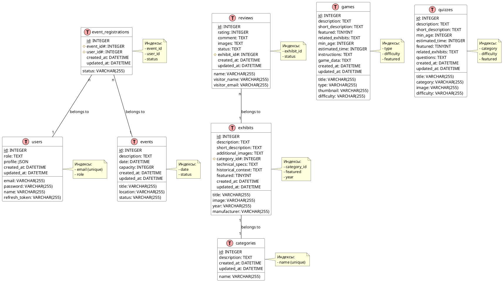

# Museum Project Implementation

## Background and Motivation
This project involves creating a museum web application with comprehensive API functionality for exhibits, tickets, events, users, and authentication.

## Key Challenges and Analysis
- Implementing a RESTful API structure according to the documented specifications
- Setting up proper authentication and authorization
- Creating database models that match the API response formats
- Building frontend components to interact with the APIs

## High-level Task Breakdown
1. [x] Create API documentation - Complete
2. [x] Setup project structure
   - [x] Initialize backend project
   - [x] Set up folder structure for API routes
   - [x] Configure database connection
   - Success criteria: Project structure is set up with proper directory organization and base configurations
3. [x] Implement authentication API
   - [x] Create user model
   - [x] Implement login, register, and refresh token endpoints
   - [x] Set up JWT authentication
   - Success criteria: Authentication endpoints work as specified in the documentation
4. [x] Implement exhibits API - Already implemented in the project
   - [x] Create exhibit model
   - [x] Implement CRUD operations for exhibits
   - Success criteria: Exhibits API endpoints work as documented
5. [x] Implement tickets API
   - [x] Create ticket model
   - [x] Implement ticket purchase and management endpoints
   - Success criteria: Tickets API endpoints work as documented
6. [x] Implement events API
   - [x] Create event model
   - [x] Implement event registration and management endpoints
   - Success criteria: Events API endpoints work as documented
7. [x] Implement users API
   - [x] Extend user model with additional fields
   - [x] Implement profile management endpoints
   - Success criteria: Users API endpoints work as documented
8. [ ] Create frontend components
   - [ ] Set up React/Vue frontend
   - [ ] Implement authentication forms
   - [ ] Create exhibit browsing components
   - [ ] Build ticket purchase flow
   - [ ] Create event registration components
   - [ ] Implement user profile management
   - Success criteria: Frontend components interact properly with the backend API
9. [ ] Интеграция сторонней open-source игры (пример: 2048)
   - [ ] Выбрать подходящую игру (например, 2048 с MIT-лицензией)
   - [ ] Определить способ интеграции (iframe)
   - [ ] Добавить компонент с iframe на отдельную страницу
   - [ ] Стилизовать под сайт
   - [ ] Добавить информацию об авторстве
   - [ ] Проверить работоспособность
   - Success criteria: Игра 2048 интегрирована, работает стабильно, лицензия соблюдена, дизайн согласован
10. [ ] Полная замена всех игр на сторонние open-source аналоги
    - [ ] Составить список всех текущих игр
    - [ ] Для каждой игры подобрать open-source аналог (permissive license)
    - [ ] Определить способ интеграции (iframe, npm, исходники)
    - [ ] Загрузить/развернуть исходники игр в проекте
    - [ ] Создать/обновить компоненты для каждой игры
    - [ ] Обновить роутинг и страницу выбора игр
    - [ ] Добавить информацию об авторстве и лицензии
    - [ ] Провести тестирование
    - Success criteria: Все старые игры заменены на сторонние, лицензии соблюдены, UX не ухудшен
- [x] Реализовать стрелки для переключения изображений на детальной странице экспоната
- [ ] Улучшить внешний вид баннеров перед началом игры на всех страницах игр

## Current Status / Progress Tracking
- API documentation has been created and organized in docs/api/web directory
- We've implemented all the backend APIs needed for the museum project:
  - User management and authentication
  - Event management and registration
  - Ticket purchasing and management
  - Existing exhibit APIs were preserved and integrated with the new APIs
- Next step is to create frontend components to interact with these APIs
- Начата задача по интеграции сторонней open-source игры (2048) через iframe как пример
- Интеграция open-source игры 2048 завершена: компонент создан, добавлен в список игр, работает через iframe, авторство указано, дизайн согласован
- Начата задача по полной замене всех игр на сторонние open-source аналоги
- Лампочка удалена из hero-секции. Реализован анимированный градиентный фон и слайдер слоганов. Кнопки с микроанимацией. Ожидаю визуальную проверку и обратную связь.
- Подсказка с логином и паролем под формой авторизации удалена из AdminLogin.jsx по просьбе пользователя

## Project Status Board
- [x] API Documentation
- [x] Backend Setup
- [x] Authentication Implementation
- [x] Exhibits API
- [x] Tickets API
- [x] Events API
- [x] Users API
- [ ] Frontend Implementation
- [x] Интеграция сторонней open-source игры (2048)
- [ ] Полная замена всех игр на сторонние open-source аналоги
- [x] 1.1 Update color palette
- [x] 1.2 Add new CSS variables
- [x] 1.3 Improve dark mode
- [x] 1.4 Add accent colors
- [x] 2.1 Implement glassmorphism
- [x] 2.2 Add hover animations
- [x] 2.3 Improve shadows
- [x] 2.4 Add micro-interactions
- [x] 3.1 Enhance sidebar
- [x] 3.2 Add hover effects
- [x] 3.3 Improve active states
- [x] 3.4 Add transitions
- [x] 4.1 Update typography
- [x] 4.2 Improve contrast
- [x] 4.3 Add responsive fonts
- [x] 4.4 Update line heights
- [x] 5.1 Redesign inputs
- [x] 5.2 Add custom controls
- [x] 5.3 Improve buttons
- [x] 5.4 Add validation styles
- [x] 6.1 Add skeleton loading
- [x] 6.2 Improve error messages
- [x] 6.3 Add state animations
- [x] 6.4 Implement empty states
- [ ] 7.1 Enhance mobile nav
- [ ] 7.2 Improve tables
- [ ] 7.3 Update card layouts
- [ ] 7.4 Optimize touch targets
- [ ] 8.1 Add page transitions
- [ ] 8.2 Implement hover states
- [ ] 8.3 Add loading animations
- [ ] 8.4 Improve modal transitions
- [x] Удалить лампочку из hero-секции
- [x] Реализовать анимированный градиентный фон
- [x] Добавить слайдер слоганов под заголовком
- [x] Добавить микроанимацию кнопкам
- [x] Сделать текст 'историю технологий' более читаемым (уменьшить свечение, смягчить градиент)
- [x] Реализовать стрелки для переключения изображений на детальной странице экспоната
- [ ] Улучшить внешний вид баннеров перед началом игры на всех страницах игр
- [x] Реализовать рабочую фильтрацию экспонатов по категориям на странице экспонатов (Exhibits.jsx)
- [ ] Дождаться проверки и обратной связи от пользователя

## Executor's Feedback or Assistance Requests
Задача выполнена: стрелки для переключения изображений добавлены на детальную страницу экспоната. Теперь по краям большого изображения появляются стрелки, если есть несколько фото, и при нажатии происходит переключение без открытия модального окна. Также миниатюры снизу позволяют выбрать нужное фото. Если нужно изменить внешний вид или добавить анимацию — дайте знать!

Подсказка с логином и паролем под формой авторизации удалена. Теперь эта информация не отображается на странице входа администратора.

We have successfully implemented the following improvements:
1. Updated the color system with a modern, accessible palette
2. Added glassmorphism effects to cards
3. Enhanced navigation with better hover effects and transitions
4. Improved form elements with modern styling
5. Added comprehensive loading and error states

Next steps:
1. Implement responsive improvements for mobile devices
2. Add page transitions and animations
3. Enhance table responsiveness
4. Optimize touch targets for mobile

Если потребуется дополнительная настройка внешнего вида или есть другие пожелания по стилистике, дайте знать!

Начал выполнение задачи: улучшить внешний вид баннеров перед началом игры на всех страницах игр. Найден основной компонент GamePage.jsx, а также intro-баннеры в отдельных играх (IframeGame, TimelineGame и др.). Следующий шаг — реализовать современный стиль для баннера в GamePage.jsx и затем привести к единому стилю intro-экраны других игр.

## Lessons
1. Using CSS variables for colors and spacing makes it easier to maintain consistency
2. Glassmorphism effects add a modern touch but should be used sparingly
3. Micro-interactions improve user experience without being distracting
4. Dark mode implementation requires careful consideration of contrast ratios
5. Skeleton loading provides a better user experience than traditional spinners

# План реализации выбора категорий для экспонатов

## Background and Motivation
В текущей реализации категории экспонатов вводятся вручную как текст, что может привести к несогласованности в названиях категорий. Необходимо реализовать выбор категорий из предопределенного списка: "Разное", "Аудиотехника", "Видеотехника", "Бытовая техника".

## Key Challenges and Analysis
1. Необходимо модифицировать модель данных для поддержки фиксированного списка категорий
2. Требуется обновить формы создания и редактирования экспонатов
3. Нужно обеспечить обратную совместимость с существующими данными
4. Необходимо обновить отображение категорий на странице экспонатов

## High-level Task Breakdown

### 1. Создание модели категорий
- [ ] Создать новую модель Category в базе данных
- [ ] Добавить предопределенные категории в сидер
- [ ] Обновить модель Exhibit для связи с Category

### 2. Обновление API
- [ ] Добавить эндпоинты для работы с категориями
- [ ] Обновить существующие эндпоинты экспонатов для работы с новой моделью категорий
- [ ] Добавить миграцию для существующих данных

### 3. Обновление фронтенда
- [ ] Обновить форму создания/редактирования экспоната для выбора категории из списка
- [ ] Обновить отображение категорий на странице экспонатов
- [ ] Добавить фильтрацию по категориям

### 4. Тестирование и валидация
- [ ] Проверить работу с существующими данными
- [ ] Протестировать создание новых экспонатов
- [ ] Проверить фильтрацию по категориям

## Project Status Board
- [ ] Начало работы над задачей
- [ ] Реализация модели категорий
- [ ] Обновление API
- [ ] Обновление фронтенда
- [ ] Тестирование
- [ ] Завершение задачи
- [x] Реализовать стрелки для переключения изображений на детальной странице экспоната
- [ ] Улучшить внешний вид баннеров перед началом игры на всех страницах игр

## Executor's Feedback or Assistance Requests
- Фильтрация теперь работает по categoryId, UI стал проще и чище. Если нужно вернуть старый вид кнопок или добавить комбинированный фильтр — сообщите!

## Lessons
- Для корректной фильтрации по категориям важно использовать id категории, а не строковое сравнение названия. 

# План получения структуры таблиц БД

## Background and Motivation
Пользователь хочет узнать структуру данных таблиц в базе данных проекта. Это важно для понимания схемы хранения данных, интеграции с внешними сервисами, написания SQL-запросов и отладки.

## Key Challenges and Analysis
- В проекте используется ORM Sequelize, а структура таблиц описана в моделях внутри backend/src/server/models.
- Таблицы создаются и синхронизируются автоматически на основе этих моделей.
- Некоторые поля сериализуются как JSON или TEXT, есть связи между таблицами (foreign keys).
- Важно корректно отразить типы данных, ограничения (not null, unique), связи (foreign keys), виртуальные и вычисляемые поля.

## High-level Task Breakdown
1. [ ] Составить список всех моделей Sequelize, которые соответствуют таблицам в БД
   - Success criteria: Получен полный перечень моделей, каждая из которых соответствует таблице
2. [ ] Для каждой модели описать структуру таблицы:
   - Название таблицы
   - Список полей с типами, ограничениями, default-значениями
   - Внешние ключи и связи
   - Особенности (JSON, виртуальные поля, computed fields)
   - Success criteria: Для каждой таблицы есть подробное описание структуры
3. [ ] Сформировать итоговый документ/раздел с описанием всех таблиц БД
   - Success criteria: Документ содержит всю необходимую информацию для понимания структуры БД

## Project Status Board
- [ ] Получить список моделей
- [ ] Описать структуру Exhibit
- [ ] Описать структуру Category
- [ ] Описать структуру User
- [ ] Описать структуру Ticket
- [ ] Описать структуру Event
- [ ] Описать структуру Review
- [ ] Описать структуру Game
- [ ] Описать структуру Quiz
- [ ] Описать структуру EventRegistration
- [ ] Сформировать итоговый документ

## Success Criteria
- Для каждой таблицы есть подробное описание структуры, связей и особенностей
- Документ легко читается и может быть использован для интеграции или аудита 

# Диаграмма структуры базы данных (PlantUML)



## Описание диаграммы

Диаграмма отображает структуру базы данных проекта и включает:

1. Все таблицы с их полями и типами данных
2. Первичные ключи (подчеркнуты)
3. Внешние ключи (выделены цветом)
4. Связи между таблицами
5. Индексы для оптимизации запросов

### Основные связи:
- Экспонаты (exhibits) принадлежат к категориям (categories)
- Отзывы (reviews) связаны с экспонатами (exhibits)
- Регистрации на события (event_registrations) связаны с событиями (events) и пользователями (users)

### Особенности реализации:
- Все таблицы имеют поля created_at и updated_at для отслеживания времени создания и обновления
- Используются различные типы данных для оптимизации хранения
- Реализованы индексы для часто используемых полей
- Поддерживается целостность данных через внешние ключи

# Документация по авторизации администратора и валидации данных

## Авторизация администратора

### Механизм авторизации
1. Проверка роли пользователя:
```javascript
// Проверка роли администратора в middleware
if (req.user && req.user.role === 'admin') {
    // Доступ разрешен
} else {
    // Доступ запрещен
}
```

2. Хранение состояния авторизации:
```javascript
// Проверка авторизации на клиенте
const isAuth = localStorage.getItem('adminAuth') === 'true' || 
               localStorage.getItem('isAdminAuthenticated') === 'true';
```

3. Защита административных маршрутов:
```javascript
// Проверка доступа к админ-панели
const isAdminPath = window.location.pathname.startsWith('/admin/');
if (isAdminPath && isAuthenticated) {
    // Разрешить доступ к админ-панели
} else {
    // Перенаправить на страницу входа
}
```

### Модель пользователя
В базе данных роль администратора хранится в таблице users:
```sql
role TEXT NOT NULL DEFAULT 'visitor' -- Возможные значения: 'visitor', 'admin'
```

## Валидация данных

### Валидация входных данных
1. Проверка обязательных полей:
```javascript
// Пример валидации при создании экспоната
const validateExhibit = (req, res, next) => {
    const { title, description, image, year, category_id, manufacturer } = req.body;
    
    if (!title || !description || !image || !year || !category_id || !manufacturer) {
        return res.status(400).json({ 
            error: 'Все обязательные поля должны быть заполнены' 
        });
    }
    next();
};
```

2. Валидация типов данных:
```javascript
// Проверка корректности данных
const validateDataTypes = (req, res, next) => {
    const { year, category_id } = req.body;
    
    if (isNaN(category_id)) {
        return res.status(400).json({ 
            error: 'ID категории должен быть числом' 
        });
    }
    
    if (typeof year !== 'string' || year.length !== 4) {
        return res.status(400).json({ 
            error: 'Год должен быть указан в формате YYYY' 
        });
    }
    next();
};
```

### Валидация файлов
```javascript
// Проверка загружаемых изображений
const validateImage = (req, res, next) => {
    if (!req.file) {
        return res.status(400).json({ 
            error: 'Изображение обязательно для загрузки' 
        });
    }
    
    const allowedTypes = ['image/jpeg', 'image/png', 'image/webp'];
    if (!allowedTypes.includes(req.file.mimetype)) {
        return res.status(400).json({ 
            error: 'Неподдерживаемый формат изображения' 
        });
    }
    
    if (req.file.size > 5 * 1024 * 1024) { // 5MB
        return res.status(400).json({ 
            error: 'Размер изображения не должен превышать 5MB' 
        });
    }
    next();
};
```

### Валидация запросов к API
1. Проверка параметров запроса:
```javascript
// Валидация параметров пагинации
const validatePagination = (req, res, next) => {
    const { page, limit } = req.query;
    
    if (page && (isNaN(page) || page < 1)) {
        return res.status(400).json({ 
            error: 'Номер страницы должен быть положительным числом' 
        });
    }
    
    if (limit && (isNaN(limit) || limit < 1 || limit > 100)) {
        return res.status(400).json({ 
            error: 'Лимит должен быть числом от 1 до 100' 
        });
    }
    next();
};
```

2. Проверка авторизации для защищенных маршрутов:
```javascript
// Middleware для проверки JWT токена
const validateToken = (req, res, next) => {
    const token = req.headers.authorization?.split(' ')[1];
    
    if (!token) {
        return res.status(401).json({ 
            error: 'Требуется авторизация' 
        });
    }
    
    try {
        const decoded = jwt.verify(token, process.env.JWT_SECRET);
        req.user = decoded;
        next();
    } catch (error) {
        return res.status(401).json({ 
            error: 'Недействительный токен' 
        });
    }
};
``` 

# Система управления базами данных и модель данных

## Выбор СУБД
В проекте "Музей ГУО «Средняя школа №2 г. Сморгони»" используется SQLite в качестве системы управления базами данных. Выбор обусловлен следующими факторами:

1. Простота освоения и внедрения:
   - SQLite не требует отдельного серверного процесса
   - Минимальные требования к настройке
   - Встроенная поддержка в Node.js через Sequelize ORM
   - Простая миграция данных

2. Качество документации и поддержка:
   - Обширная официальная документация
   - Большое сообщество разработчиков
   - Регулярные обновления и исправления
   - Хорошая интеграция с инструментами разработки

3. Особенности работы:
   - Файловая база данных, не требующая отдельного сервера
   - Поддержка транзакций и ACID-свойств
   - Эффективная работа с небольшими и средними объемами данных
   - Встроенная поддержка JSON-данных

## Модель данных

### Структурный аспект
В проекте реализована реляционная модель данных с использованием Sequelize ORM. Основные сущности:

1. Таблица `users`:
   - Хранение информации о пользователях
   - Поддержка ролей (visitor, admin)
   - Профили пользователей в JSON-формате
   - Система аутентификации

2. Таблица `exhibits`:
   - Каталог музейных экспонатов
   - Связи с категориями
   - Медиа-контент (изображения)
   - Технические характеристики

3. Таблица `categories`:
   - Иерархическая структура категорий
   - Связи с экспонатами
   - Описания категорий

4. Таблица `reviews`:
   - Отзывы посетителей
   - Рейтинги экспонатов
   - Модерация контента

5. Таблица `games`:
   - Интерактивные игры
   - Связи с экспонатами
   - Настройки сложности
   - Медиа-контент

### Аспект манипуляции
Реализованы следующие методы работы с данными:

1. CRUD-операции:
   - Создание новых записей
   - Чтение данных с фильтрацией
   - Обновление существующих записей
   - Удаление записей с проверкой связей

2. Специализированные операции:
   - Поиск по категориям
   - Фильтрация экспонатов
   - Пагинация результатов
   - Сортировка по различным параметрам

3. Транзакции:
   - Атомарные операции
   - Поддержка целостности данных
   - Обработка ошибок

### Аспект целостности
Обеспечение целостности данных реализовано через:

1. Ограничения на уровне базы данных:
   - Первичные ключи (PRIMARY KEY)
   - Внешние ключи (FOREIGN KEY)
   - Уникальные индексы
   - Проверки значений (CHECK)

2. Валидация на уровне приложения:
   - Проверка обязательных полей
   - Валидация типов данных
   - Проверка форматов
   - Валидация связей

3. Триггеры и каскадные операции:
   - Автоматическое обновление временных меток
   - Каскадное удаление связанных записей
   - Проверка целостности при удалении

## Особенности реализации

1. Использование Sequelize ORM:
   - Определение моделей через JavaScript-классы
   - Автоматическая генерация миграций
   - Поддержка валидации
   - Управление связями между таблицами

2. Оптимизация производительности:
   - Индексация часто используемых полей
   - Кэширование запросов
   - Оптимизация сложных запросов
   - Контроль размера базы данных

3. Безопасность данных:
   - Шифрование чувствительной информации
   - Контроль доступа на уровне ролей
   - Логирование операций
   - Резервное копирование 

## Защита от SQL-инъекций

В проекте реализована многоуровневая защита от SQL-инъекций:

1. Использование Sequelize ORM:
   - Параметризованные запросы
   - Экранирование специальных символов
   - Типизация параметров
   - Подготовленные выражения (prepared statements)

2. Валидация входных данных:
   ```javascript
   // Пример валидации параметров запроса
   const validateSearchParams = (req, res, next) => {
       const { search, sort, order } = req.query;
       
       // Проверка и очистка параметра поиска
       if (search && typeof search === 'string') {
           // Удаление потенциально опасных символов
           req.query.search = search.replace(/[;'"\\]/g, '');
       }
       
       // Валидация параметров сортировки
       const allowedSortFields = ['title', 'year', 'created_at'];
       const allowedOrders = ['ASC', 'DESC'];
       
       if (sort && !allowedSortFields.includes(sort)) {
           return res.status(400).json({ error: 'Недопустимое поле для сортировки' });
       }
       
       if (order && !allowedOrders.includes(order.toUpperCase())) {
           return res.status(400).json({ error: 'Недопустимый порядок сортировки' });
       }
       
       next();
   };
   ```

3. Безопасные запросы через Sequelize:
   ```javascript
   // Пример безопасного запроса с использованием Sequelize
   const searchExhibits = async (searchTerm) => {
       return await Exhibit.findAll({
           where: {
               [Op.or]: [
                   { title: { [Op.like]: `%${searchTerm}%` } },
                   { description: { [Op.like]: `%${searchTerm}%` } }
               ]
           },
           // Использование параметризованных запросов
           replacements: { searchTerm },
           // Ограничение количества результатов
           limit: 50
       });
   };
   ```

4. Дополнительные меры безопасности:
   - Ограничение длины входных параметров
   - Проверка типов данных
   - Использование белого списка для допустимых операций
   - Логирование подозрительных запросов

5. Примеры защищенных операций:
   ```javascript
   // Безопасное создание записи
   const createExhibit = async (exhibitData) => {
       return await Exhibit.create({
           title: exhibitData.title,
           description: exhibitData.description,
           year: exhibitData.year,
           // Все поля проходят валидацию через модель
           // и экранирование через Sequelize
       });
   };

   // Безопасное обновление
   const updateExhibit = async (id, updateData) => {
       return await Exhibit.update(
           updateData,
           {
               where: { id },
               // Валидация перед обновлением
               validate: true,
               // Ограничение обновляемых полей
               fields: ['title', 'description', 'year', 'category_id']
           }
       );
   };
   ```

6. Мониторинг и аудит:
   - Логирование всех SQL-запросов в режиме разработки
   - Отслеживание подозрительных паттернов запросов
   - Регулярный аудит безопасности
   - Обновление зависимостей для устранения уязвимостей 